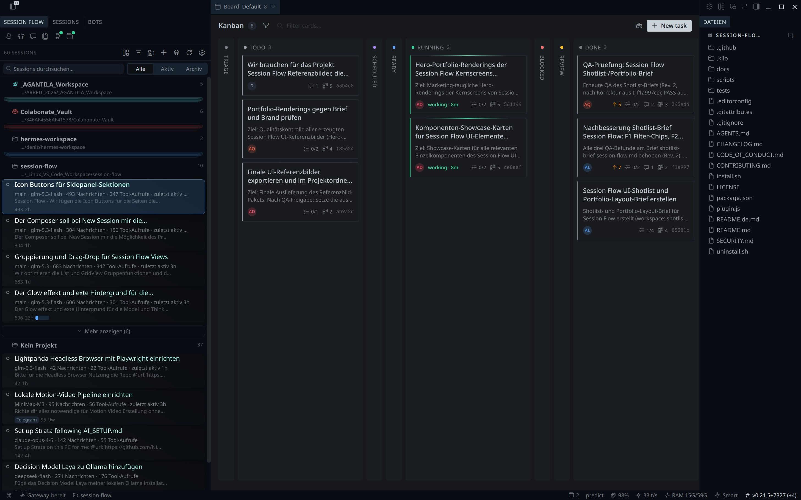
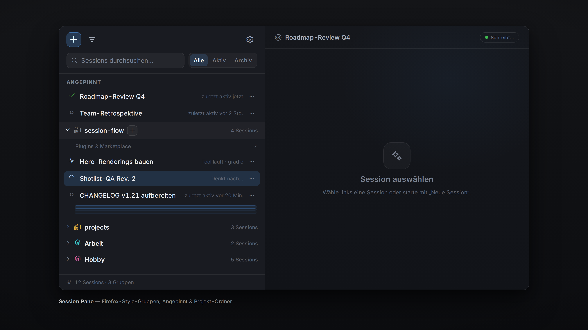
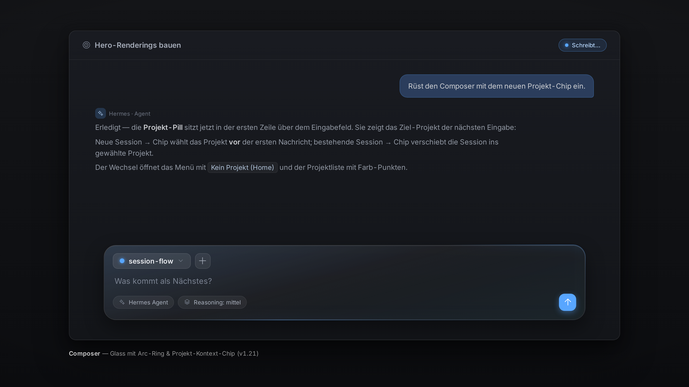
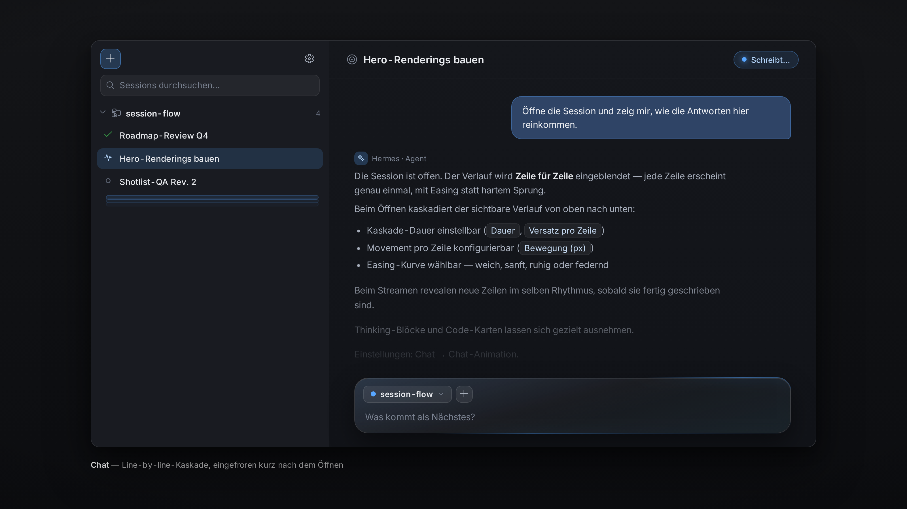
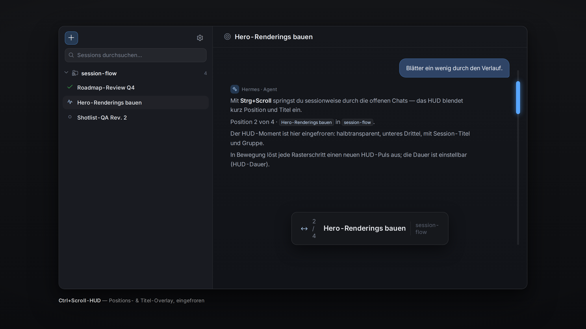
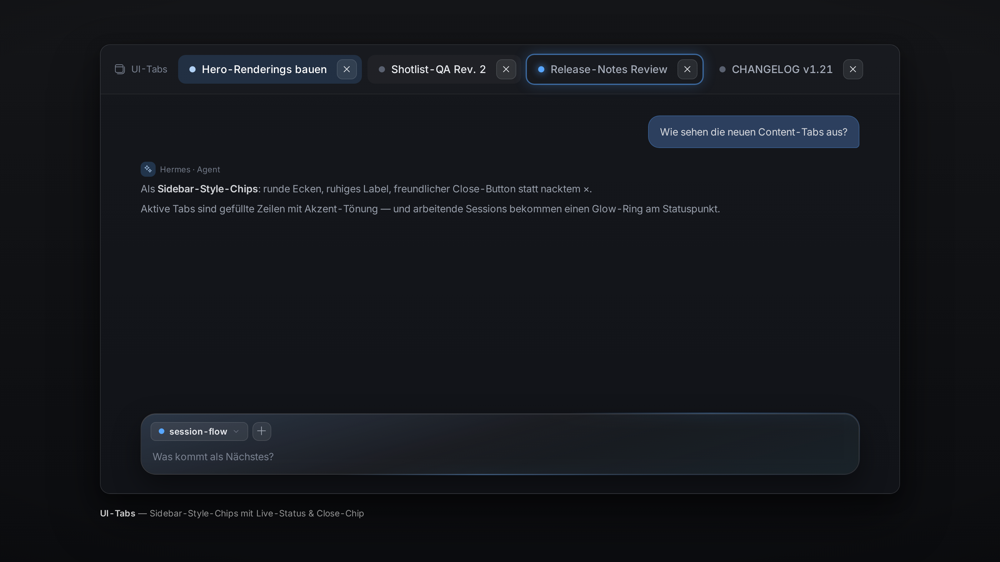
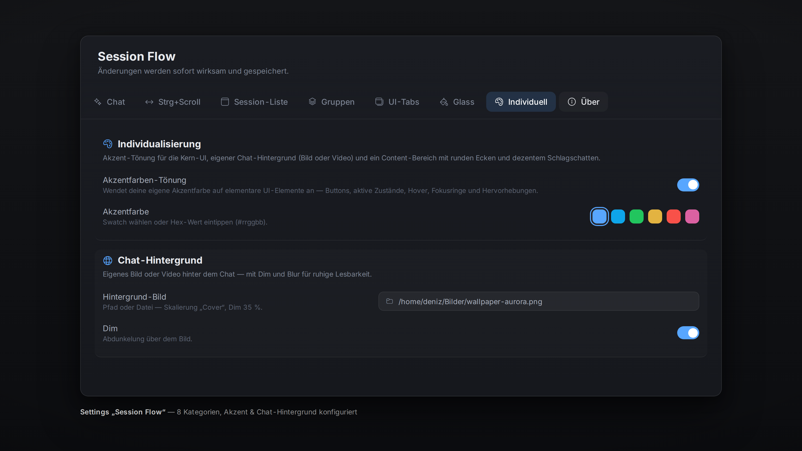
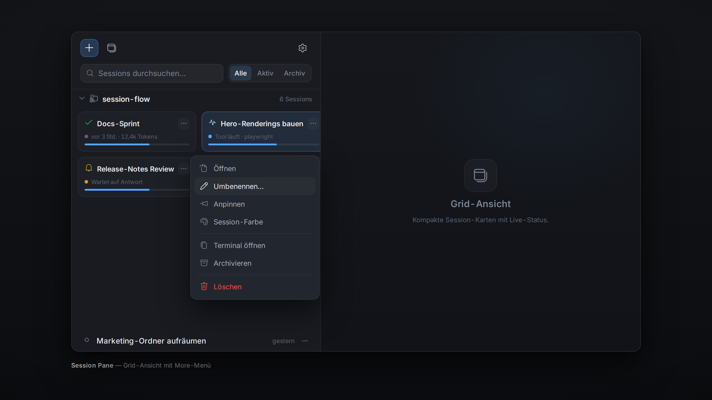
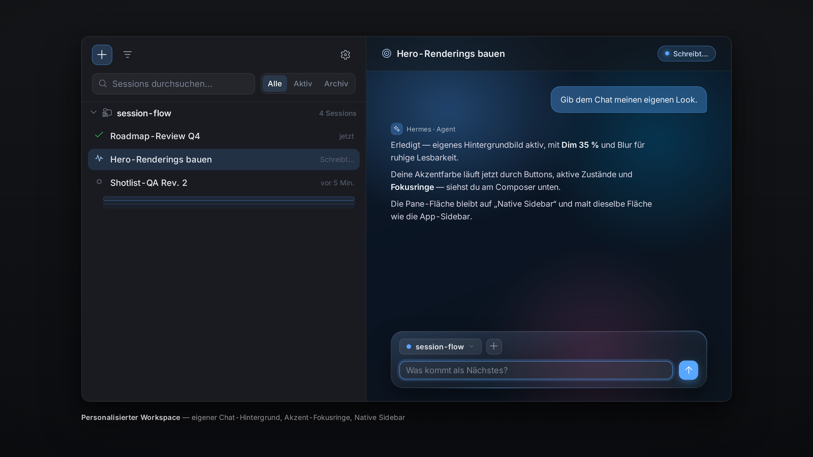
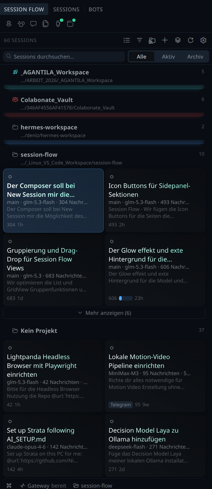

# Session Flow — Hermes Desktop Plugin

[English](README.md) · **Deutsch**

<p align="center">
  
</p>

Weiche Zeile-für-Zeile-Animation im Chat, Strg+Scroll durch die Sessions,
Firefox-artige Session-Gruppen, Glass-Lesbarkeit für den Composer und
Sidebar-Style-Tabs im Content-Bereich und volle Individualisierung — **sechs
Features in einem Plugin**, ohne
Build-Schritt, ohne Abhängigkeiten, alles live über die eingebaute
Einstellungsseite konfigurierbar.

Entwickelt und im Einsatz unter Linux (Wayland/KDE) mit Hermes Desktop und dem
Plugin-SDK (`~/.hermes/desktop-plugins/`).

Ein Projekt von **[AGANTILA — Deniz Yilmaz](https://agantila.com)**.

## Showcase

| | |
|---|---|
|  |  |
|  |  |
|  |  |
|  |  |
|  | |

### Echte App-Screenshots

Zwei zusätzliche Screenshots wurden aus einer laufenden Hermes-Desktop-Session
aufgenommen (`sf-hero-a9-sidebar-kanban-files-16x9.jpg`,
`sf-hero-a10-sidebar-grid-9x16.png`), um das Plugin im realen App-Kontext zu
zeigen — die Showcase-Aufnahmen oben sind aus HTML-Quellen reproduzierte,
pixelgenaue Kompositionen für die Marketplace-Galerie.

▶ **In Bewegung:** die 5-Sekunden-Hyperframes-Animation
([MP4](docs/marketing/animation/sf-hyperframes-1920x1080-5s.mp4) ·
[WebM](docs/marketing/animation/sf-hyperframes-1920x1080-5s.webm) ·
[GIF](docs/marketing/animation/sf-hyperframes-1920x1080-5s.gif))
zeigt Kaskade, Projekt-Chip, Strg+Scroll-HUD und Kontext-Donut in einem kurzen Loop.

**19 Komponenten-Karten (1:1)** — jedes UI-Element, das den neuen Look prägt,
eigene Karte, fertig für Doku, Folien oder den Marketplace-Eintrag:
[docs/marketing/components/](docs/marketing/components/). Vollständige Inventarliste
in [docs/marketing/INVENTORY.md](docs/marketing/INVENTORY.md).

> Alle 30 Bilder sind aus den HTML-Quellen unter
> [docs/marketing/src/](docs/marketing/src/) reproduzierbar.
> Re-Render: `docs/marketing/src/heroes/render.sh` und
> `docs/marketing/src/components/render.sh`.

## Features

1. **Chat-Animation (Zeile für Zeile)** — Antworten werden mit Easing weich
   eingeblendet. Beim Öffnen/Wechseln eines Chats laufen die sichtbaren Zeilen
   als Kaskade von oben nach unten ein; während des Streamens animiert jede
   Zeile genau einmal, sobald sie fertig geschrieben ist. Dauer, Versatz,
   Bewegung, Easing-Presets, Thinking-/Code-/Listen-Optionen — alles einstellbar.
2. **Strg + Scroll = Session-Zyklus** — Mit gedrückter Zusatztaste (Standard
   `Ctrl`) und Mausrad durch die aktiven Sessions scrollen. Ein HUD zeigt
   Position und Titel. Zoom-Flächen (Bild-Lightbox, Code-Editor) behalten ihr
   eigenes Verhalten.
3. **Session-Tabs mit Firefox-artigen Gruppen** — Eine Pane listet alle
   Sessions als kompakte Tabs mit **Aktivitäts-Icon** (denkt / schreibt /
   Tool läuft / wartet auf Antwort / fertig / Fehler). Sessions lassen sich in
   benannte, farbige **Gruppen** legen (Rechtsklick oder Drag & Drop), Gruppen
   klappen zu einem **Stapel** zusammen (spine / fanned / pill). Optional
   automatische Gruppierung nach Datum, Quelle oder **Projekt-Ordner** (im
   Look der Hermes-Desktop-„Projekte"-Baumstruktur — Ordner-Icon, Hover-Caret,
   Hover-„+" für eine neue Session genau dort; ein Tab auf einen
   Projekt-Header gezogen verschiebt ihn wirklich, mit Ziel-Hervorhebung und
   „Gelandet"-Flash). Eine **Such- & Schnellfilter-Leiste** (alle / angepinnt /
   aktiv) grenzt die Liste live ein. Jede Zeile/Karte trägt ein
   **More-Menü (⋯)** — Öffnen-Varianten, Terminal, Umbenennen, Farbe, Anpinnen,
   Zweig, In Projekt verschieben, Archivieren, Löschen, ID kopieren — und das
   Toolbar-＋ startet eine **neue Session im zuletzt gewählten Projekt**. Die
   Pane rendert als **Liste oder Grid** (Karten-Optionen in den Einstellungen)
   und kann optional die **native Tab-Leiste ersetzen** (`tabs.asTabSelector`),
   sobald sie das Umschalten zwischen Sessions schon abdeckt. Über der Toolbar
   sitzt die **App-Schnellstart-Zeile**: Icon-Buttons für Neue Session,
   Fähigkeiten, Messaging, Artefakte, Geplante Jobs und Kanban (gleiche
   Reihenfolge und Icons wie die erste Sektion der App-Sidebar), die bei
   schmaler Pane-Breite dynamisch in weitere Zeilen umbricht — mit
   **Status-Pips** auf Kanban und Geplanten Jobs (läuft / blockiert / Review /
   Fehler, gespeist aus den eigenen App-Endpunkten; Kanban erscheint nur, solange
   das Kanban-Plugin aktiv ist).
4. **Glass & Lesbarkeit** — Optionaler Frost-Effekt für **Eingabefeld** und
   **UI-Chips**: eine weiche Blur-Fläche mit dezentem, aus der Hermes-Akzent-
   farbe gefärbtem **Verlaufs-Overlay** (transparent auslaufend), damit Texte
   auch ohne eigene Hintergrundfläche gut lesbar bleiben. Blur, Sättigung,
   Deckkraft, Tönung, Verlaufswinkel/-stärke und Bereiche (Eingabefeld / Chips /
   Statusleiste) sind frei einstellbar — inklusive eines **umlaufenden
   Glow-Rings** am Rand (derselbe Effekt, den Hermes bei laufenden Sessions
   nutzt).
5. **UI-Tabs im Sidebar-Look** — Die Tabs des Content-Bereichs werden zu leicht
   abgerundeten Chips wie die Sidebar-Sessions: ruhiger Hover/aktiver Zustand,
   verbessertes Label (Schreibweise, Größe) und ein freundlicherer **Close-Button**
   (Klickfläche, Hover-Chip, Sichtbarkeit bei Hover / immer / am aktiven Tab).
   **Live-Infos aus dem Sidepanel**: arbeitende Sessions (denkt / schreibt /
   Tools) tragen den umlaufenden Glow-Ring auf ihrem Tab, der Status-Punkt
   bleibt ein-/ausblendbar.
6. **Individualisierung** — eigene **Akzentfarbe** für elementare UI-Elemente
   (Buttons, aktive Zustände, Hover, Fokusringe), eigener **Chat-Hintergrund**
   (eigene Bild- oder Videodatei, mit Darstellung / Abdunkeln / Weichzeichnen
   und Geltungsbereich), wählbarer **Pane-Fläche** für das Session-Flow-Pane
   selbst (Native Sidebar = Hermes-Default, Chat = bisheriger Look, Ohne =
   kein eigener Fill) und der **Content-Bereich der Tabs** wird mit runden
   Ecken, feiner Kontur, Abstand zum Layout-Rand und dezentem Schlagschatten
   abgesetzt (Radius, Abstand, Schattenstärke, Geltungsbereich).

Alles ist in den **Plugin-Einstellungen** anpassbar: `Session Flow`-Seite in der
Sidebar, ⌘K/Ctrl+K → „Session Flow: Einstellungen", oder das Zahnrad in der Pane.
Die Seite hat eine **sticky Kategorie-Leiste** (Chat · Strg+Scroll · Session-Liste ·
Gruppen · UI-Tabs · Glass · Individuell · Über) und Ein-Klick-Presets für die UI-Tabs.


> Hinweis: `docs/overview.png` ist optional — lege dort gern einen Screenshot ab.

## Installation

Voraussetzung: Hermes Desktop (neu genug für das Plugin-SDK,
`~/.hermes/desktop-plugins/` wird unterstützt).

```bash
# Aus dem Repo-Verzeichnis:
./install.sh            # kopiert plugin.js nach ~/.hermes/desktop-plugins/session-flow/
./install.sh --link     # Entwicklungsmodus: Symlink statt Kopie (Hot-Reload beim Speichern)
```

Danach in der App: **⌘K / Ctrl+K → „Reload desktop plugins"** — oder die App
einmal neu starten. Das Plugin lädt danach automatisch bei jedem Start.

**Manuell:** die Datei `plugin.js` nach
`~/.hermes/desktop-plugins/session-flow/plugin.js` kopieren. Der Ordnername
**muss** `session-flow` heißen (= Plugin-id).

**Deinstallieren:** `./uninstall.sh` (entfernt nur das Installationsziel,
nicht das Repo).

### Teilen

- Repo-URL weitergeben + Installationsanleitung oben.
- Oder ein Install-Link (Hermes Deep-Link): `hermes://plugin/install?repo=<owner>/<repo>`
  — der Nutzer bekommt einen Bestätigungsdialog und wählt die Komponenten.

## Nutzung

| Aktion | Wie |
|---|---|
| Session öffnen | Klick auf einen Tab |
| Kontextmenü (Pin, Gruppe, Farbe, Öffnen als…) | Rechtsklick auf einen Tab |
| Gruppe anlegen / bearbeiten / löschen | Zahnrad-/„+"-Button im Pane-Header oder Rechtsklick/Doppelklick auf eine Gruppen-Überschrift |
| Session in Gruppe verschieben | Tab per Drag & Drop auf eine Gruppe ziehen — oder Rechtsklick → „In Gruppe verschieben" |
| Gruppe einklappen | Klick auf die Gruppen-Überschrift |
| Sessions durchscrollen | `Ctrl` + Mausrad |
| Einstellungen | Sidebar „Session Flow" oder ⌘K → „Session Flow: Einstellungen" |

## Einstellungen (Kurzüberblick)

Volle Referenz inkl. Defaults: [docs/SETTINGS.md](docs/SETTINGS.md).
Die Seite hat eine **sticky Kategorie-Leiste** (Chat · Strg+Scroll · Session-Liste ·
Gruppen · UI-Tabs · Glass · Über) — Klick springt zur Sektion, Scrollen markiert
die aktuelle. Die UI-Tabs-Sektion bietet zusätzlich Ein-Klick-Presets
(„Sidebar-Look", „Minimal", „Hermes-Standard").

- **Chat-Animation**: an/aus, Kaskade beim Öffnen, Zeile-für-Zeile beim
  Streamen, Dauer, Versatz pro Zeile, max. Staffel-Schritte, Bewegung (px),
  Easing (4 Presets), Thinking-Blöcke überspringen, Code-Blöcke, Listenpunkte.
- **Strg+Scroll**: an/aus, Zusatztaste (`Ctrl`/`Alt`/`Ctrl+Shift`/`Meta`),
  Schwelle, Sperrzeit, Richtung umkehren, Umlauf, HUD an/aus + Dauer,
  Ignorier-Selektoren (CSS).
- **Session-Tabs**: Dichte (kompakt/bequem), Ansicht (Liste/Grid — Spalten,
  Kartenbreite, Abstand, Titel-Zeilen, Vorschau, Info-Dichte wie Hermes,
  Text oben ausgerichtet, kompaktes Kontextfenster als **Donut** (Ring mit Loch) für
  Live-Sessions, max. sichtbare Einträge je Gruppe mit „Mehr anzeigen“),
  Zeilen-/Karten-Design (Hintergrund-Verlauf, Schlagschatten, Titel-Verlauf,
  Auswahl-Tönung/-Kontur/-Schatten inkl. Hover-Stufe, Live-Glow mit dem
  **glühenden Ring** der App, Hover-Anhebung — alle Farben per **Farb-Picker**,
  Swatches oder Hex, mit Alpha #RRGGBBAA),
  Status-Darstellung (Icon/Punkt/beides),
  Zeit, Vorschau, Nachrichtenanzahl, Quelle, Öffnen-als (Ersetzen/Stapeln/Tab),
  max. Sessions, Cron ausblenden, Live-Poll, Refresh.
- **Tab-Gruppen**: an/aus, Auto-Gruppierung (aus/Datum/Quelle), Stapel-Stil,
  „Nicht gruppiert"-Bereich.
- **UI-Tabs**: Sidebar-Optik, Radius/Abstände, Trennlinien, aktiver Zustand,
  Label (Schreibweise/Größe), Status-Punkt, Close-Button (Modus/Klickfläche/
  Hover-Chip), Glow an arbeitenden Tabs.
- **Glass & Lesbarkeit**: an/aus, Blur, Sättigung, Flächen-Deckkraft,
  Akzent-Tönung, Verlauf (an/aus, Winkel, Stärke, Endpunkt), feine Kontur,
  Bereiche (Eingabefeld / Chips / Statusleiste).
- **Individualisierung**: Akzent-Tönung (Swatch oder Hex), Chat-Hintergrund
  (Bild/Video über nativen Datei-Picker, Darstellung/Abdunkeln/Weichzeichnen/
  Geltungsbereich).

## Projektstruktur

```
session-flow/
├── plugin.js                    # DAS Plugin (eine Datei, wird 1:1 geladen)
├── install.sh                   # Installer (Kopie oder --link für Dev)
├── uninstall.sh                 # Entfernt die installierte Kopie
├── package.json                 # Nur npm-Skripte — keine Abhängigkeiten
├── scripts/
│   └── check.mjs                # Syntaxcheck + i18n-Key-Audit (nur Node)
├── tests/
│   └── render-test.mjs          # Headless-Render-Smoketest (Pane + Einstellungen)
├── docs/
│   ├── README.md                # Doku-Index
│   ├── AGENT-GUIDE.md           # Einstiegspunkt für Mitwirkende/Agenten
│   ├── PLANNING.md              # Plan-Prozess: Lebenszyklus, Template, Checkliste
│   ├── plans/                   # Ein Dokument pro nicht-trivialem Vorhaben (TEMPLATE.md = Vorlage)
│   ├── SETTINGS.md              # Alle Optionen erklärt
│   ├── DEVELOPMENT.md           # Architektur & Dev-Workflow
│   ├── APP-INTEGRATION.md       # App-Hooks, auf die wir uns stützen + Verifikation
│   └── ROADMAP.md               # Ideen & bekannte Grenzen
├── .github/
│   ├── workflows/check.yml      # CI: npm run check bei Push/PR
│   ├── ISSUE_TEMPLATE/          # Bug- & Feature-Vorlagen
│   └── PULL_REQUEST_TEMPLATE.md
├── CHANGELOG.md                 # Keep-a-Changelog-Stil
├── CONTRIBUTING.md              # Beitrags-Guide
├── SECURITY.md                  # Sicherheitshinweise
├── CODE_OF_CONDUCT.md
└── LICENSE (MIT)
```

## Entwicklung

Alles steckt in **einer** Datei: [`plugin.js`](plugin.js). Kein Build, kein
`npm install` — Desktop-Plugins werden als reines ESM zur Laufzeit geladen und
bei jedem Speichern hot-reloaded.

```bash
npm run check          # Syntaxcheck + Locale-Key-Audit (nur Node nötig)
npm test               # Render-Smoketest (Pane + Einstellungen, ohne App)
./install.sh --link    # ein mal einrichten, danach: speichern -> App lädt neu
```

Konventionen, die man nicht brechen darf (sonst lädt das Plugin nicht):

- **Kein JSX** — nur `jsx()`/`jsxs()` von `react/jsx-runtime` (die Datei wird
  unkompiliert geladen).
- **Nur drei Imports**: `@hermes/plugin-sdk`, `react`, `react/jsx-runtime`.
- **Keine hartkodierten Farben** — nur Theme-Variablen (`var(--ui-…)` / `var(--dt-…)`).
- **Keine Backticks im CSS-Template** — auch nicht in Kommentaren; ein einzelner
  Backtick beendet das Template und bricht das Plugin (`npm run check` fängt es).
- Timers/Listener über `ctx`, DOM-Observer + injizierte `<style>`-Tags über
  `ctx.onDispose` abräumen.

Mehr Details zur Architektur (Controller-Design, Animations-Dedupe, Stores,
Verifikations-Rezepte): [docs/DEVELOPMENT.md](docs/DEVELOPMENT.md) ·
App-Hooks & fragile Selektoren: [docs/APP-INTEGRATION.md](docs/APP-INTEGRATION.md) ·
Ein Feature planen? Einstieg bei [docs/AGENT-GUIDE.md](docs/AGENT-GUIDE.md) —
dem Einstiegspunkt des Plan-/Dokumentationssystems unter
[docs/plans/](docs/plans/).

## Bekannte Grenzen

- **Profil-Scope:** Die Session-Liste liest das *aktive* Profil (über den
  Gateway-RPC `session.list`). Multi-Profil-Ansicht ist geplant.
- **Gruppen-Sortierung:** Manuelle Gruppen haben feste Reihenfolge (Erstellung);
  freies Umsortieren von Gruppen und Tab-Reihenfolgen ist Roadmap.
- **Animation** greift auf Assistant-Nachrichten (Markdown-Blöcke). User-
  Nachrichten und Tool-Karten bleiben bewusst unangetastet.
- `prefers-reduced-motion` **deaktiviert alle Animationen** automatisch.
- Mehr in [docs/ROADMAP.md](docs/ROADMAP.md).

## Mitwirken

Siehe [CONTRIBUTING.md](CONTRIBUTING.md) — Dev-Loop, Konventionen, PR-Checkliste
und wie das Repo auf GitHub veröffentlicht wird.

## Sicherheit

Siehe [SECURITY.md](SECURITY.md) — Plugins laufen ungesandboxed im Renderer;
Meldungen bitte über GitHub.

## Lizenz

MIT (Open Source) — © 2026 **AGANTILA — Deniz Yilmaz**
([agantila.com](https://agantila.com)). Siehe [LICENSE](LICENSE).
