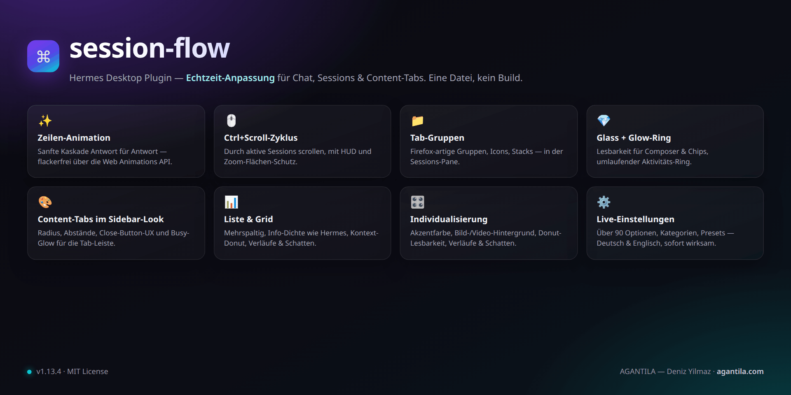

# Session Flow — Hermes Desktop Plugin

**English** · [Deutsch](README.de.md)

Smooth line-by-line chat animation, Ctrl+Scroll session cycling, Firefox-style
session groups, glass readability for the composer, and sidebar-style content
tabs, and full personalization — six features in one plain-ESM plugin, all
live-configurable from a
built-in settings page.

Developed and used on Linux (Wayland/KDE) with Hermes Desktop and its plugin
SDK (`~/.hermes/desktop-plugins/`). No build step, no dependencies, one file.

A project by **[AGANTILA — Deniz Yilmaz](https://agantila.com)**.

## Features

1. **Line-by-line chat animation** — Assistant answers ease in instead of
   popping. Opening or switching a chat cascades the visible lines top to
   bottom; while streaming, each line animates exactly once as soon as it is
   fully written. Duration, stagger, travel, easing presets, thinking/code/list
   options — all adjustable.
2. **Ctrl+Scroll = session cycling** — Hold a modifier (Ctrl by default) and
   scroll through your active sessions, with a HUD showing position and title.
   Zoom surfaces (image lightbox, Monaco editor) keep their own behaviour.
3. **Session pane with Firefox-style groups** — A pane lists every session as a
   compact tab with an **activity icon** (thinking / writing / tool running /
   waiting / done / error). Sessions go into named, coloured **groups** (drag &
   drop or right-click), groups collapse into a **stack** (spine / fanned /
   pill); optional auto-grouping by date or source. Every row/card carries a
   **More (⋯) actions menu** — open variants, terminal, rename, colour, pin,
   branch, move to project, archive, delete, copy ID — and the toolbar **＋
   starts a new session in your last chosen project**. The pane renders as a
   **list or a grid** (card options in the settings).
4. **Glass & readability** — An optional frost effect for the **input field**
   and **UI chips**: a soft blur with a subtle **accent-tinted gradient overlay
   fading to transparent**, so labels stay readable even without their own
   background. Blur, saturation, opacity, tint, gradient angle/strength and
   scopes (composer / chips / status bar) are fully configurable — including a
   travelling glow ring on the border (the same effect Hermes uses on running
   session rows).
5. **Sidebar-style UI tabs** — The content-area tabs become gently rounded
   chips like the sidebar session rows: calm hover/active states, a better
   **label** (case, size) and a friendlier **close button** (hit area, hover
   chip, visibility: on hover / always / active tab only). **Live session info
   from the sidebar engine**: sessions that are working (thinking / writing /
   tools) get the travelling glow ring on their tab.
6. **Personalization** — pick your own **accent color** for core UI elements
   (buttons, active states, hovers, focus rings), set a **chat background**
   (your own image or video file, with fit / dimming / blur and scope), and
   **frame the content area** of tabs with rounded corners and a soft drop
   shadow (radius, shadow strength, hairline outline, scope).

Everything is adjustable on the **plugin settings page** — `Session Flow` in
the sidebar, ⌘K/Ctrl+K → “Session Flow: Einstellungen”, or the gear icon in the
pane. The page has a **sticky category bar** (Chat · Ctrl+Scroll · Session list ·
Groups · UI tabs · Glass · Personal · About) and one-click presets for the UI tabs.



> `docs/overview.png` is optional — drop your own screenshot there.

## Installation

Requirement: Hermes Desktop recent enough to support the plugin SDK and the
`~/.hermes/desktop-plugins/` directory.

```bash
# From the repo directory:
./install.sh            # copies plugin.js to ~/.hermes/desktop-plugins/session-flow/
./install.sh --link     # dev mode: symlink instead of a copy (hot reload on save)
```

Then in the app: **⌘K / Ctrl+K → “Reload desktop plugins”** — or simply restart
the app once. After that the plugin loads automatically on every start.

**Manual:** copy `plugin.js` to `~/.hermes/desktop-plugins/session-flow/plugin.js`.
The folder name **must** be `session-flow` (= the plugin id).

**Uninstall:** `./uninstall.sh` (removes the installed copy, not the repo).

### Sharing

- Hand over the repo URL plus the install steps above.
- Or use a Hermes deep link: `hermes://plugin/install?repo=<owner>/<repo>` —
  the user gets a confirmation dialog and picks the components.

## Usage

| Action | How |
|---|---|
| Open a session | Click a tab |
| Context menu (pin, group, colour, open as…) | Right-click a tab |
| Create / edit / delete a group | Gear / “+” button in the pane header — or right-click / double-click a group header |
| Move a session into a group | Drag & drop onto a group — or right-click → “In Gruppe verschieben” |
| Collapse a group | Click the group header |
| Cycle through sessions | `Ctrl` + mouse wheel |
| Settings | Sidebar “Session Flow” or ⌘K → “Session Flow: Einstellungen” |

## Settings

Full reference incl. defaults: [docs/SETTINGS.md](docs/SETTINGS.md).

The page has a **sticky category bar** (Chat · Ctrl+Scroll · Session list ·
Groups · UI tabs · Glass · About) — clicking jumps to a section, scrolling
highlights the current one. The UI-tabs section additionally offers one-click
presets (“Sidebar-Look”, “Minimal”, “Hermes-Standard”).

- **Chat animation**: on/off, cascade on open, line-by-line while streaming,
  duration, stagger, max steps, travel (px), easing (4 presets), skip thinking
  blocks, code blocks, list items.
- **Ctrl+Scroll**: on/off, modifier key, threshold, cooldown, invert, wrap,
  HUD on/off + duration, ignore selectors (CSS).
- **Session list**: density (compact/cozy), view (list/grid — columns, card
  width, gap, title lines, preview, info density like Hermes, compact
  context-window % for live sessions, max visible entries per group with
  “show more”), row/card design
  (gradient background, drop shadows, gradient titles — colors optionally with
  alpha via #RRGGBBAA —, selected-state
  tint/outline/shadow incl. hover strength, live active & waiting glow), status style
  (icon/dot/both), time, preview, message
  count, source badge, open-as (replace/stack/tab), max sessions, hide cron,
  live poll, refresh.
- **Tab groups**: on/off, auto-grouping (off/date/source), stack style,
  “ungrouped” bucket.
- **UI tabs**: sidebar look, radius/gaps, dividers, active state, label
  (case/size), status dot, close button (mode/hit area/hover chip), glow on
  working tabs.
- **Glass & readability**: on/off, blur, saturation, fill opacity, accent tint,
  gradient (on/off, angle, strength, fade point), hairline ring, scopes.
- **Personalization**: accent tint (swatch or hex), chat background (image or
  video via native file picker, fit/dim/blur/scope), content-area frame
  (radius, shadow strength, hairline outline, scope).

## Project structure

```
session-flow/
├── plugin.js                    # THE plugin (single file, loaded as-is)
├── install.sh                   # Installer (copy or --link for dev)
├── uninstall.sh                 # Removes the installed copy
├── package.json                 # npm scripts only — no dependencies
├── scripts/
│   └── check.mjs                # Syntax check + i18n key audit (stdlib only)
├── tests/
│   └── render-test.mjs          # Headless render smoke test (pane + settings)
├── docs/
│   ├── README.md                # Docs index
│   ├── SETTINGS.md              # Every option explained (German)
│   ├── DEVELOPMENT.md           # Architecture & dev workflow (German)
│   ├── APP-INTEGRATION.md       # App hooks we depend on + verification recipes
│   └── ROADMAP.md               # Ideas & known limits
├── .github/
│   ├── workflows/check.yml      # CI: npm run check on push/PR
│   ├── ISSUE_TEMPLATE/          # Bug report & feature request forms
│   └── PULL_REQUEST_TEMPLATE.md
├── CHANGELOG.md                 # Keep-a-Changelog style (German)
├── CONTRIBUTING.md              # Contribution guide (German)
├── SECURITY.md                  # Security notes (German)
├── CODE_OF_CONDUCT.md
└── LICENSE (MIT)
```

## Development

Everything lives in **one** file: [`plugin.js`](plugin.js). No build, no
`npm install` — desktop plugins are loaded as plain ESM at runtime and
hot-reloaded on every save.

```bash
npm run check          # syntax check + locale key audit (Node only)
npm test               # headless render smoke test (pane + settings)
./install.sh --link    # set up once; then: save -> the app reloads the plugin
```

House rules that must not be broken (otherwise the plugin refuses to load):

- **No JSX** — only `jsx()` / `jsxs()` from `react/jsx-runtime` (the file is
  loaded uncompiled).
- **Only three imports**: `@hermes/plugin-sdk`, `react`, `react/jsx-runtime`.
- **No hard-coded colours** — theme variables only (`var(--ui-…)` / `var(--dt-…)`).
- **No backticks inside the CSS template literal** — not even in comments; a
  stray backtick terminates the template and breaks the plugin (`npm run check`
  catches it).
- Clean up timers/listeners via `ctx`, DOM observers + injected `<style>` tags
  via `ctx.onDispose`.

Architecture (controllers, animation dedupe, stores, verification recipes):
[docs/DEVELOPMENT.md](docs/DEVELOPMENT.md) ·
App hooks & fragile selectors: [docs/APP-INTEGRATION.md](docs/APP-INTEGRATION.md).

## Known limits

- **Profile scope:** the session list reads the *active* profile (gateway RPC
  `session.list`). Multi-profile view is planned.
- **Group ordering:** manual groups keep creation order; free reordering of
  groups and tab order is on the roadmap.
- **Animation** applies to assistant messages (markdown blocks); user messages
  and tool cards stay untouched on purpose.
- `prefers-reduced-motion` disables all animations automatically.
- More in [docs/ROADMAP.md](docs/ROADMAP.md).

## Contributing

See [CONTRIBUTING.md](CONTRIBUTING.md) (German) — dev loop, conventions, PR
checklist and how to publish the repo to GitHub.

## Security

See [SECURITY.md](SECURITY.md) — plugins run unsandboxed in the renderer; report
issues via GitHub.

## License

MIT (open source) — © 2026 **AGANTILA — Deniz Yilmaz**
([agantila.com](https://agantila.com)). See [LICENSE](LICENSE).
